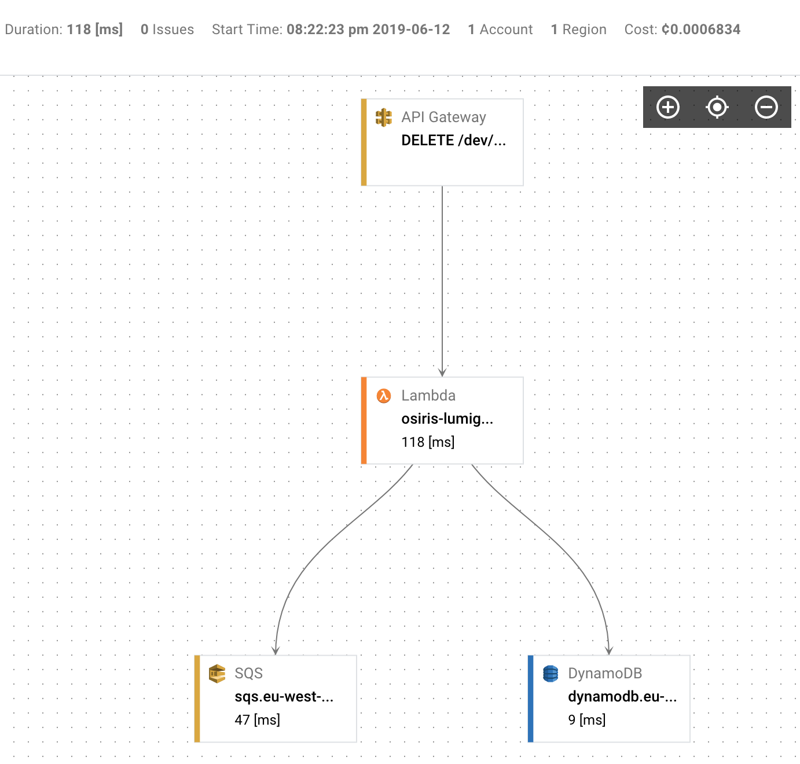

# Lumigo Example Project
This project demonstrates integration with the Lumigo monitoring platform (https://lumigo.io).

A filter is defined in `ApiDefinition.kt` that is applied to all requests. The filter handles the request by calling `LumigoRequestExecutor.execute()`. It passes in the event and context that were passed to the Osiris lambda by AWS. It also passes in an anonymous function that invokes the handler with the request. This dispatches the request to the appropriate handler.

## Deploying the Project
In order to deploy the project you need to:

* Get a Lumigo account (https://lumigo.io)
* Update the variable `LUMIGO_TOKEN` in `ApiDefinition.kt` with your token

## Making Requests
In order to see the project working you will need to make some POST requests. The easiest way to do this is to use `curl` in a terminal or to use [Postman](https://www.getpostman.com/).

This will create an item in the DynamoDB table with a value "foo" and publish a message to SQS. A lambda will receive the SQS message and create an object in S3

    curl -d foo https://<API ID>.execute-api.eu-west-1.amazonaws.com/dev/values

All requests will be recorded by Lumigo and visible in the Transactions view of the Lumigo platform.

Individual transactions can be viewed in the Lumigo platform:

